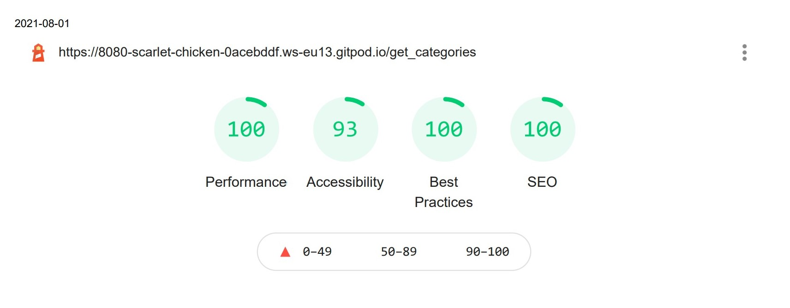

# Testing

[View website in GitHub Pages](https://milestone-3-book-review.herokuapp.com/)

[GO TO README.md](README.md)

## Table of contents

1. [Testing User Stories](#Testing-User-Stories)
2. [Manual Testing](#Manual-Testing)
3. [Automated Testing](#Automated-Testing)
   1. [Code Validation](#Code-Validation)
   2. [Browser Validation](#HTML-Validation)
   3. [Lighthouse Auditing](#Lighthouse)
4. [User Testing](#User-Testing)

## Testing User Stories

### New/Potential User Goals:

1. As a new user, I want to easily navigate through the website to find the relevant content, effortlessly.

   - The navigation is clearly defined and easily navigable for users to find and use.

   - The navigation bar are found easily on each page, no matter the device.

2. As a new user, I want to watch uploaded books and have the ability to add, update, and delete books as well.

- It is easy to find where and how to find and see what I am looking for wherever you are on the site.

3. As a new user, I Want to easily have the ability to create, read, update and delete records.

   - The navbar makes it easy to find pages for CRUD (create, read, update, delete).

4. As a new user, I Want to easily have the ability to search the records i the database

   - Search ability on the startpage.

5. As a new user, I want some features on the site:

   - [x] I want to be able to log in and log out.

   - [x] I want to be able to register on the site.

   - [x] I want to be able to add books.

   - [x] I want to be able to delete ny own books.

   - [x] I want to be able to see my own books.

## Manual Testing

### Elements / Items Testing

#### Start Page (Home)

The front page works flawlessly in all screen sizes and is self-explanatory.

1. The links in the navbar:
   - [x] The link goes to the correct URL .
         access to.
2. The search form:
   - [x] The search form is working well.
3. The badges for showing added books:
   - [x] The badges work and expand and look good.

#### Owner Page (user added books)

The owner page works as expected and, no bugs are detected. Buttons/icons work as expected and work in all screen sizes.

1. Edit and delete buttons:
   - [x] The buttons (edit and delete) works as expected.
2. Add book button (only if no books are uploaded):
   - [x] The button works as expected and allow the user to add a book.
3. The badges:
   - [x] The badges work properly and the drop-down effect work find.

#### Log In, Log Out, Register:

The login, log out and register pages works as expected and works in all screen sizes.

#### Manage categories (only for admin)

The manage categories page works as expected and works in all screen sizes.

1. Edit category:
   - [x] The button link goes to the correct URL (edit category) and works as expected.
2. Delete category:
   - [x] The button link goes to the correct URL (delete category) no verification takes place.

- All links lead to the right place and, no broken links
- All icons, headers, and text is in the right place regardless of screen size
- Hover effects on some important links
- All functionality on the site is controlled and works

---

## Automated Testing

### code Validation

- The [RESPONSIVE WEB DESIGN CHECKER](http://ami.responsivedesign.is/) service is used to check how responsive the website is.

  - Is also checked with the browser's built-in responsive tool (inspect).

- The [W3C CSS Validator](https://jigsaw.w3.org/css-validator/) service was used to validate the CSS code used.

- The [jshint](https://jshint.com/) service was used to validate the JavaScript code used.

- All HTML and CSS pages are formatted using [The formatter](https://www.freeformatter.com/).

- Used [corrector](https://www.corrector.co/) for spell checking.

### CSS Validation

#### Results:

- It´s only one CSS file in the project (style.css)
  - (The test is done from Swedish browser, translated into English: Congratulations! No errors were found)

## Lighthouse

Screenshot from the index page (desktop device)

[Lighthouse test as PDF ](static/readme-resources/lighthouse.pdf)

## User Testing

Family members were asked to review the site and documentation to point out any bugs and/or user experience issues. Their helpful advice throughout the process led to many UX changes to create a better experience.

[Back to the top](#Testing)
